# Deal AI — Full Functional Documentation

> Comprehensive documentation of the Deal AI platform: every feature, every flow, every endpoint. Read once, build twice.
>
> Three repositories make up the system:
> - **`deal-ai`** — Next.js 14 frontend (App Router, Lucia auth, Konva editor, Siri voice).
> - **`deal-ai-server`** — Express.js backend (Prisma + MongoDB, OAuth, cron publisher).
> - **`TakamolAdvancedAI`** — Flask Python AI service (gpt-4o-mini, dall-e-3, Ideogram, vision).

---

## 0. What is Deal AI?

### In one paragraph

**Deal AI is an AI-powered marketing co-pilot for real-estate developers.** Drop in a project brochure (PDF, photos, basic info) and the platform turns it into a complete, weeks-long social-media campaign — automatically. It writes the marketing case study (target audience, ROI math, strategy), drafts hundreds of posts in Arabic and English tuned per network, generates a custom image for every post, schedules them across the calendar, and publishes them on autopilot to LinkedIn, Twitter/X, Facebook, and Instagram. The user can do all of this by clicking through forms — or just by *speaking* to the built-in voice assistant.

### Core skills & services (what the user gets)

| Service | What it does for the user |
|---|---|
| **AI brochure ingestion** | Upload a PDF brochure → AI reads every page, extracts project name, location, land area, every unit type with rooms / baths / spaces / finishing, and pre-fills the project form. Onboarding goes from 30 minutes of typing to 30 seconds. |
| **AI case study generation** | One click produces a complete marketing case study: who to target on each platform, recommended marketing strategy, performance metrics, ROI projections, posting frequency, pros/cons. All localized to Arabic. |
| **AI content campaigns** | Pick the platforms you want, the campaign goal (Branding / Engagement / Sales), the content length (Short / Medium / Long), and how many weeks. The platform generates an idea per post, writes the post copy in Arabic per network, and creates a custom AI image for each post. |
| **AI image generation per post** | Every generated post gets a unique on-brand image rendered by DALL-E 3 from a prompt the system writes for it. Images are stored in your cloud bucket and served from a CDN. |
| **In-app image editor** | Open any image in a Konva-based editor: apply branded frame templates, place Arabic / English text with proper RTL handling, add booking buttons / phone numbers / website URLs, crop, export. |
| **Multi-platform connect & autopost** | Connect your LinkedIn / Twitter / Facebook / Instagram accounts with a one-click OAuth popup. Confirmed posts publish on autopilot to the right account at the scheduled time. Tokens refresh themselves. |
| **Voice assistant ("Siri")** | Hold the mic and say *"create a project called Palm Hills in Riyadh with five villas and two apartment types"* — the assistant calls the right APIs and the project appears in your dashboard. Same for adding properties, creating case studies, drafting posts, deletions. |
| **Calendar / scheduler view** | A monthly calendar shows every post, color-coded by network, click any post to edit text, swap image, change time, mark confirmed, or move to trash. |
| **Bilingual UX with RTL** | Full Arabic and English support, RTL layouts where appropriate, locale-aware AI prompts (Arabic content for Arabic projects). |
| **Soft-delete recycle bin** | Deleted projects, properties, case studies, and posts go to a per-type bin and can be restored. |
| **Project + property data model** | Track real-estate projects, the units inside each (apartments / villas with rooms, baths, finishing, gardens, pools, view), the social platforms connected to each project, and every campaign run against it. |

### How it works — a typical user journey

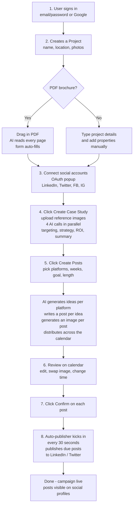
```mermaid
flowchart TD
    A[1. User signs in<br/>email/password or Google] --> B[2. Creates a Project<br/>name, location, photos]
    B --> C{PDF brochure?}
    C -->|Yes| D[Drag in PDF<br/>AI reads every page<br/>form auto-fills]
    C -->|No| E[Type project details<br/>and add properties manually]
    D --> F[3. Connect social accounts<br/>OAuth popup<br/>LinkedIn, Twitter, FB, IG]
    E --> F
    F --> G[4. Click Create Case Study<br/>upload reference images<br/>4 AI calls in parallel<br/>targeting, strategy, ROI, summary]
    G --> H[5. Click Create Posts<br/>pick platforms, weeks, goal, length]
    H --> I[AI generates ideas per platform<br/>writes a post per idea<br/>generates an image per post<br/>distributes across the calendar]
    I --> J[6. Review on calendar<br/>edit, swap image, change time]
    J --> K[7. Click Confirm on each post]
    K --> L[8. Auto-publisher kicks in<br/>every 30 seconds<br/>publishes due posts<br/>to LinkedIn / Twitter]
    L --> M[Done - campaign live<br/>posts visible on social profiles]
```

### Under the hood (technical summary)

The platform is split across three services, each with one job:

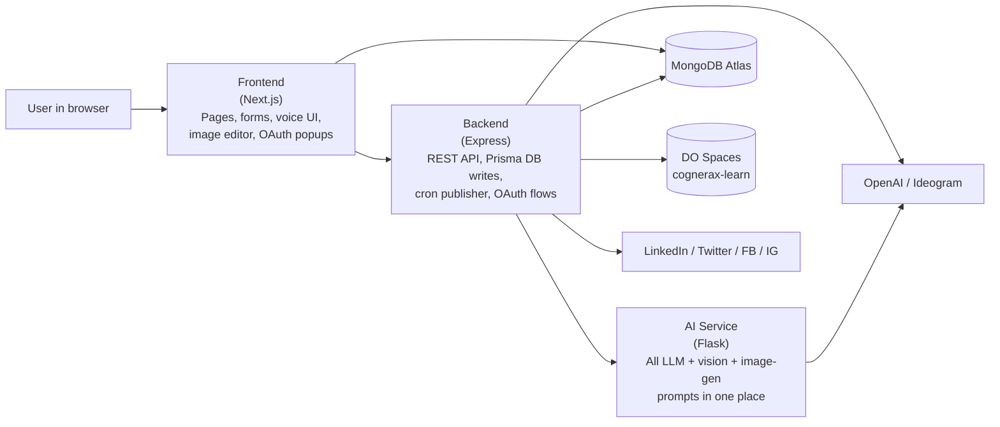
```mermaid
flowchart LR
    User[User in browser]
    FE["Frontend<br/>(Next.js)<br/>Pages, forms, voice UI,<br/>image editor, OAuth popups"]
    BE["Backend<br/>(Express)<br/>REST API, Prisma DB writes,<br/>cron publisher, OAuth flows"]
    PY["AI Service<br/>(Flask)<br/>All LLM + vision + image-gen<br/>prompts in one place"]
    DB[(MongoDB Atlas)]
    S3[(DO Spaces<br/>cognerax-learn)]
    Open[OpenAI / Ideogram]
    Soc[LinkedIn / Twitter / FB / IG]

    User --> FE
    FE --> BE
    BE --> PY
    PY --> Open
    BE --> Open
    BE --> DB
    FE --> DB
    BE --> S3
    BE --> Soc
```

- **Frontend** handles all UI, form validation, voice capture, image editing, and OAuth popups. Authenticates users with Lucia + Google OAuth.
- **Backend** is the orchestrator: receives every request, fans out to the AI service for LLM work, writes results to MongoDB via Prisma, uploads media to DigitalOcean Spaces, and publishes confirmed posts to social networks every 30 seconds via a cron job.
- **AI service** is a stateless prompt library: every endpoint is a wrapper around an OpenAI or Ideogram call with a carefully tuned system prompt. Keeping prompts in one place means tone, tone-shifts, and dialect tuning happen in one repo.

### What's special about it (vs. generic AI writers like Buffer, Hootsuite, Jasper)

- **Real-estate verticalized**: data model speaks "Project", "Apartment", "Villa", "ROI", "marketing strategy" — not generic "campaigns".
- **PDF brochure ingestion**: nobody else turns a developer's brochure into a structured project in one drop.
- **Arabic-first**: prompts, dictionaries, RTL layout, dialect-aware copy.
- **Voice control**: hands-free project + content management is a novelty in the AI-marketing space.
- **End-to-end**: from raw brochure → published content, all in one tool.

---

## Table of Contents

0. [What is Deal AI?](#0-what-is-deal-ai) *(plain-language overview)*
1. [Executive Summary](#1-executive-summary) *(technical)*
2. [System Architecture](#2-system-architecture)
3. [Tech Stack](#3-tech-stack)
4. [Data Model](#4-data-model)
5. [State Machines](#5-state-machines)
6. [Authentication](#6-authentication)
7. [Project Management](#7-project-management)
8. [PDF Brochure Auto-fill](#8-pdf-brochure-auto-fill)
9. [Case Study Generation](#9-case-study-generation)
10. [Post Generation Pipeline](#10-post-generation-pipeline)
11. [Image Generation](#11-image-generation)
12. [Social-Media OAuth & Posting](#12-social-media-oauth--posting)
13. [Cron Scheduler](#13-cron-scheduler)
14. [Voice Assistant ("Siri")](#14-voice-assistant-siri)
15. [Image Editor (Konva)](#15-image-editor-konva)
16. [Localization](#16-localization)
17. [Storage](#17-storage)
18. [Frontend API Reference](#18-frontend-api-reference)
19. [Backend API Reference](#19-backend-api-reference)
20. [Python AI Service Reference](#20-python-ai-service-reference)
21. [Configuration / Environment Variables](#21-configuration--environment-variables)
22. [Deployment](#22-deployment)
23. [Appendix A — Key Prompts](#23-appendix-a--key-prompts)

---

## 1. Executive Summary

**Deal AI** is an AI-driven social-media marketing platform for real-estate developers. It generates marketing case studies, plans content campaigns, drafts posts, generates images, and publishes them across multiple social networks. Arabic is the primary language; English is supported.

### Headline capabilities
- **Authentication**: Email/password with Argon2 + Google OAuth via Lucia (frontend Next.js Server Actions).
- **Project management**: Real-estate projects, properties (apartments / villas), connected social platforms, soft-delete + restore.
- **PDF brochure → structured data**: Upload a PDF; gpt-4o-mini vision extracts title/location/units/floor-plans into form fields.
- **AI case study**: Four parallel calls to the Python AI service produce target-audience segmentation, marketing strategy, ROI projections, and project summary in one shot.
- **Multi-platform post campaigns**: AI-generated ideas + post content per platform across N weeks; dall-e-3 image per post; auto-distributed to days of the week.
- **Image editor**: Konva canvas with frame templates, RTL-aware text overlays, crop, export.
- **Voice assistant ("Siri")**: GPT-4o function-calling for hands-free project / property / case-study / post management. Web Speech API.
- **Cron publisher**: Every 30 s, publishes confirmed posts to LinkedIn (`/v2/ugcPosts`) and Twitter/X (`/2/tweets`) with token-refresh.
- **Bilingual i18n**: Arabic and English dictionaries; URL-prefixed routing.
- **Cloud media**: All uploads land in DigitalOcean Spaces (`cognerax-learn` bucket).

### Design tenets
- Three-tier separation: UI (Next.js) ↔ orchestration (Express) ↔ inference (Flask).
- Python service is the single source of LLM/Image/Vision calls so prompts stay in one place.
- Backend is Prisma-only DB writer; frontend never touches the DB directly.
- Cron publisher in the Express backend is the single fan-out to social APIs.

---

## 2. System Architecture

### High-level

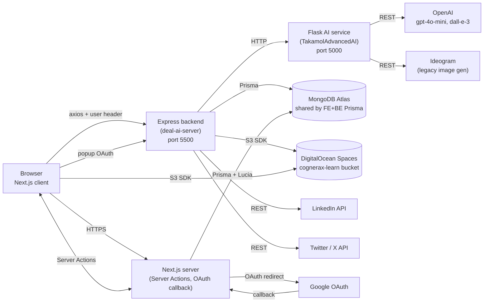
```mermaid
flowchart LR
    Browser["Browser<br/>Next.js client"]
    NextSvr["Next.js server<br/>(Server Actions, OAuth callback)"]
    Express["Express backend<br/>(deal-ai-server)<br/>port 5500"]
    Python["Flask AI service<br/>(TakamolAdvancedAI)<br/>port 5000"]
    Mongo[("MongoDB Atlas<br/>shared by FE+BE Prisma")]
    DOS[("DigitalOcean Spaces<br/>cognerax-learn bucket")]
    OpenAI["OpenAI<br/>gpt-4o-mini, dall-e-3"]
    Ideo["Ideogram<br/>(legacy image gen)"]
    LI["LinkedIn API"]
    TW["Twitter / X API"]
    Google["Google OAuth"]

    Browser -->|HTTPS| NextSvr
    NextSvr <-->|Server Actions| Browser
    Browser -->|axios + user header| Express
    NextSvr -->|OAuth redirect| Google
    Google -->|callback| NextSvr
    Express -->|HTTP| Python
    Express -->|Prisma| Mongo
    NextSvr -->|Prisma + Lucia| Mongo
    Express -->|S3 SDK| DOS
    Browser -->|S3 SDK| DOS
    Python -->|REST| OpenAI
    Python -->|REST| Ideo
    Express -->|REST| LI
    Express -->|REST| TW
    Browser -->|popup OAuth| Express
```

### Inter-service dependencies

| From | To | Protocol | Purpose |
|---|---|---|---|
| Browser | Next.js | HTTPS | Pages, server actions |
| Browser | Express | HTTPS + base64 `user` header | All app data CRUD |
| Browser | DigitalOcean Spaces | HTTPS (CDN) | Image rendering only |
| Browser | Express OAuth popup | HTTPS | LinkedIn/Twitter connect popup |
| Next.js | MongoDB | Prisma | Lucia sessions + User + Project |
| Express | MongoDB | Prisma | All data writes |
| Express | Python AI | HTTP (private) | LLM/vision/image calls |
| Express | OpenAI | HTTPS | Dall-e-3 image gen direct |
| Express | LinkedIn / Twitter | HTTPS | OAuth + publishing |
| Python | OpenAI | HTTPS | Chat + vision |
| Python | Ideogram | HTTPS | Legacy image (out of credit) |

**Service-port discovery (local dev):**
| Service | Port | Notes |
|---|---|---|
| Next.js | 3000 | `yarn dev` |
| Express | 5500 | `yarn dev` (nodemon) |
| Flask Python | 5000 | `python app.py` |
| Ollama (optional) | 11434 | Not used currently |

---

## 3. Tech Stack

### Frontend (`deal-ai`)
| Layer | Library |
|---|---|
| Framework | Next.js 14.2.5 (App Router) |
| Language | TypeScript 5 |
| Auth | Lucia 3.2 + Arctic 1.9 + @node-rs/argon2 |
| ORM | Prisma 5.17 (MongoDB) |
| UI | Tailwind 3 + Radix UI + shadcn/ui |
| Forms | React Hook Form + Zod |
| Image canvas | Konva 9.3 + Sharp 0.33 |
| Voice | `voicegpt-assistant` 1.0 + Web Speech API |
| LLM client | `openai` SDK |
| HTTP | axios + ky |
| Storage | aws-sdk v2 (DigitalOcean Spaces) |
| i18n | `translate` + custom dictionaries |
| State | React Context + Hook |
| Toasts | Sonner |

### Backend (`deal-ai-server`)
| Layer | Library |
|---|---|
| Runtime | Node.js ≥ 16, ESM |
| Framework | Express 4.18 |
| ORM | Prisma 5 (MongoDB, **same schema as frontend**) |
| Cron | `node-cron` 3.0 |
| HTTP client | axios 1.7 |
| Image | Sharp 0.33 |
| Storage | aws-sdk 2 (DO Spaces) |
| Security | helmet + cors + morgan |
| Auth helpers | lucia + argon2 (used minimally) |

### Python AI service (`TakamolAdvancedAI`)
| Layer | Library |
|---|---|
| Runtime | Python 3.12 |
| Framework | Flask 3 + flask-cors + flask-socketio |
| LLM | `openai` 1.35 (gpt-4o-mini, gpt-4o, dall-e-3) |
| Vision | OpenAI gpt-4o-mini (image_url content blocks) |
| Image gen | OpenAI DALL-E + Ideogram V_2 |
| Concurrency | threading + concurrent.futures (parallel AI calls) |
| Lang detect | `langdetect` |
| Server | gunicorn (`-w 4`) prod / Flask dev server local |

---

## 4. Data Model

### ER diagram

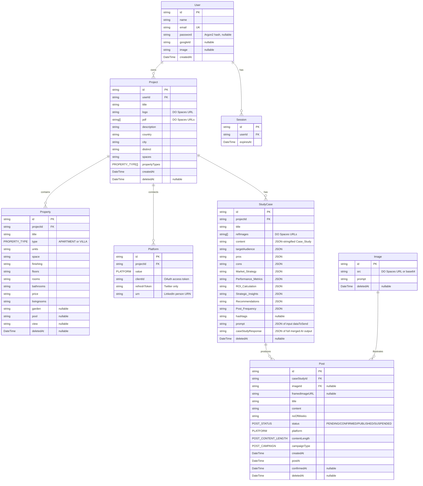
```mermaid
erDiagram
    User ||--o{ Project : owns
    User ||--o{ Session : has
    Project ||--o{ Property : contains
    Project ||--o{ Platform : connects
    Project ||--o{ StudyCase : has
    StudyCase ||--o{ Post : produces
    Image ||--o{ Post : illustrates

    User {
        string id PK
        string name
        string email UK
        string password "Argon2 hash, nullable"
        string googleId "nullable"
        string image "nullable"
        DateTime createdAt
    }
    Session {
        string id PK
        string userId FK
        DateTime expiresAt
    }
    Project {
        string id PK
        string userId FK
        string title
        string logo "DO Spaces URL"
        string[] pdf "DO Spaces URLs"
        string description
        string country
        string city
        string distinct
        string spaces
        PROPERTY_TYPE[] propertyTypes
        DateTime createdAt
        DateTime deletedAt "nullable"
    }
    Platform {
        string id PK
        string projectId FK
        PLATFORM value
        string clientId "OAuth access token"
        string refreshToken "Twitter only"
        string urn "LinkedIn person URN"
    }
    Property {
        string id PK
        string projectId FK
        string title
        PROPERTY_TYPE type "APARTMENT or VILLA"
        string units
        string space
        string finishing
        string floors
        string rooms
        string bathrooms
        string price
        string livingrooms
        string garden "nullable"
        string pool "nullable"
        string view "nullable"
        DateTime deletedAt "nullable"
    }
    StudyCase {
        string id PK
        string projectId FK
        string title
        string[] refImages "DO Spaces URLs"
        string content "JSON-stringified Case_Study"
        string targetAudience "JSON"
        string pros "JSON"
        string cons "JSON"
        string Market_Strategy "JSON"
        string Performance_Metrics "JSON"
        string ROI_Calculation "JSON"
        string Strategic_Insights "JSON"
        string Recommendations "JSON"
        string Post_Frequency "JSON"
        string hashtags "nullable"
        string prompt "JSON of input dataToSend"
        string caseStudyResponse "JSON of full merged AI output"
        DateTime deletedAt "nullable"
    }
    Image {
        string id PK
        string src "DO Spaces URL or base64"
        string prompt
        DateTime deletedAt "nullable"
    }
    Post {
        string id PK
        string caseStudyId FK
        string imageId FK "nullable"
        string framedImageURL "nullable"
        string title
        string content
        string noOfWeeks
        POST_STATUS status "PENDING/CONFIRMED/PUBLISHED/SUSPENDED"
        PLATFORM platform
        POST_CONTENT_LENGTH contentLength
        POST_CAMPAIGN campaignType
        DateTime createdAt
        DateTime postAt
        DateTime confirmedAt "nullable"
        DateTime deletedAt "nullable"
    }
```

### Enums

| Enum | Values |
|---|---|
| `PLATFORM` | `FACEBOOK`, `LINKEDIN`, `INSTAGRAM`, `TWITTER` |
| `PROPERTY_TYPE` | `APARTMENT`, `VILLA` |
| `POST_CAMPAIGN` | `BRANDING_AWARENESS`, `ENGAGEMENT`, `SALES_CONVERSION` |
| `POST_CONTENT_LENGTH` | `SHORT`, `MEDIUM`, `LONG` |
| `POST_STATUS` | `PENDING`, `CONFIRMED`, `PUBLISHED`, `SUSPENDED` |

### Soft-delete

- `Project`, `Property`, `StudyCase`, `Image`, `Post` carry `deletedAt: DateTime?`.
- `User`, `Session`, `Platform` are hard-deleted only.

### Schema source

Both `deal-ai/prisma/schema.prisma` and `deal-ai-server/prisma/schema.prisma` are **byte-identical**. Drift is a future hazard.

---

## 5. State Machines

### Post lifecycle

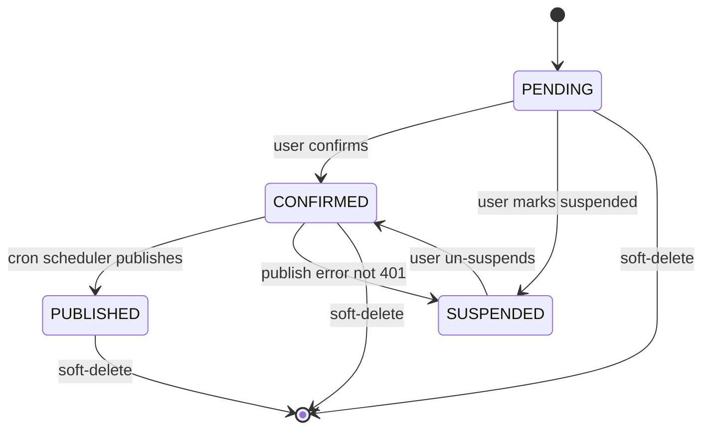
```mermaid
stateDiagram-v2
    [*] --> PENDING
    PENDING --> CONFIRMED: user confirms
    PENDING --> SUSPENDED: user marks suspended
    CONFIRMED --> PUBLISHED: cron scheduler publishes
    CONFIRMED --> SUSPENDED: publish error not 401
    SUSPENDED --> CONFIRMED: user un-suspends
    PENDING --> [*]: soft-delete
    CONFIRMED --> [*]: soft-delete
    PUBLISHED --> [*]: soft-delete
```

### OAuth state lifecycle (LinkedIn / Twitter)

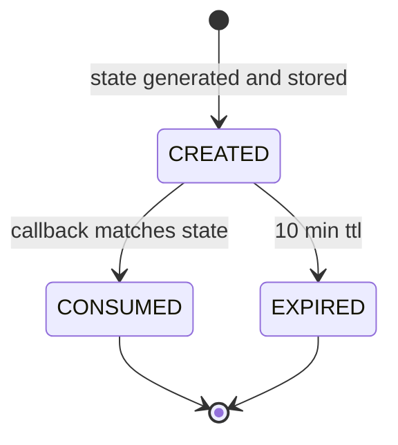
```mermaid
stateDiagram-v2
    [*] --> CREATED: state generated and stored
    CREATED --> CONSUMED: callback matches state
    CREATED --> EXPIRED: 10 min ttl
    CONSUMED --> [*]
    EXPIRED --> [*]
```

---

## 6. Authentication

### 6.1 Email/password sign-up

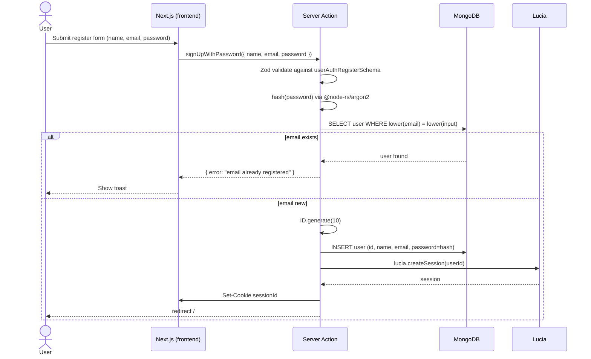
```mermaid
sequenceDiagram
    actor U as User
    participant FE as Next.js (frontend)
    participant SA as Server Action
    participant DB as MongoDB
    participant L as Lucia

    U->>FE: Submit register form (name, email, password)
    FE->>SA: signUpWithPassword({ name, email, password })
    SA->>SA: Zod validate against userAuthRegisterSchema
    SA->>SA: hash(password) via @node-rs/argon2
    SA->>DB: SELECT user WHERE lower(email) = lower(input)
    alt email exists
        DB-->>SA: user found
        SA-->>FE: { error: "email already registered" }
        FE-->>U: Show toast
    else email new
        SA->>SA: ID.generate(10)
        SA->>DB: INSERT user (id, name, email, password=hash)
        SA->>L: lucia.createSession(userId)
        L-->>SA: session
        SA->>FE: Set-Cookie sessionId
        SA-->>U: redirect /
    end
```

Code refs:
- `deal-ai/src/actions/users.ts:21-65`
- `deal-ai/src/actions/helpers.ts:39-46` — `hash()`
- `deal-ai/src/validations/users.ts:24-28` — schema

### 6.2 Google OAuth sign-in

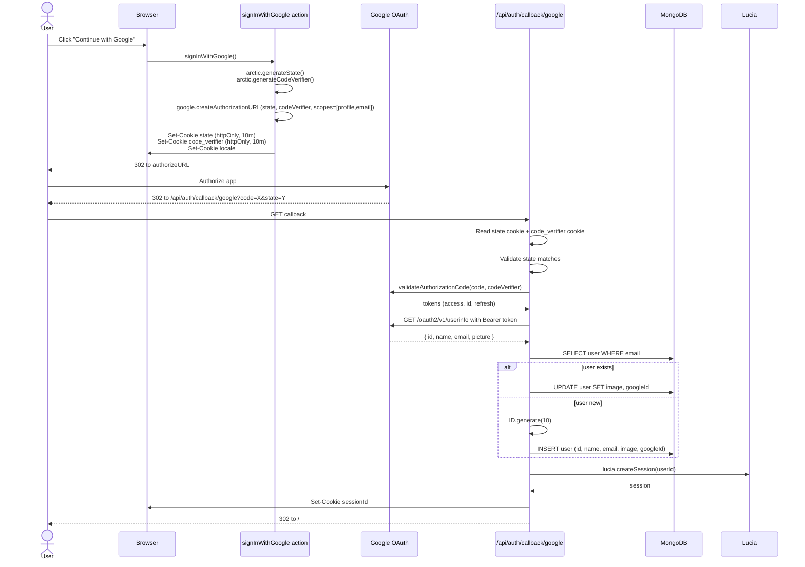
```mermaid
sequenceDiagram
    actor U as User
    participant FE as Browser
    participant SA as signInWithGoogle action
    participant G as Google OAuth
    participant CB as /api/auth/callback/google
    participant DB as MongoDB
    participant L as Lucia

    U->>FE: Click "Continue with Google"
    FE->>SA: signInWithGoogle()
    SA->>SA: arctic.generateState()<br/>arctic.generateCodeVerifier()
    SA->>SA: google.createAuthorizationURL(state, codeVerifier, scopes=[profile,email])
    SA->>FE: Set-Cookie state (httpOnly, 10m)<br/>Set-Cookie code_verifier (httpOnly, 10m)<br/>Set-Cookie locale
    SA-->>U: 302 to authorizeURL
    U->>G: Authorize app
    G-->>U: 302 to /api/auth/callback/google?code=X&state=Y
    U->>CB: GET callback
    CB->>CB: Read state cookie + code_verifier cookie
    CB->>CB: Validate state matches
    CB->>G: validateAuthorizationCode(code, codeVerifier)
    G-->>CB: tokens (access, id, refresh)
    CB->>G: GET /oauth2/v1/userinfo with Bearer token
    G-->>CB: { id, name, email, picture }
    CB->>DB: SELECT user WHERE email
    alt user exists
        CB->>DB: UPDATE user SET image, googleId
    else user new
        CB->>CB: ID.generate(10)
        CB->>DB: INSERT user (id, name, email, image, googleId)
    end
    CB->>L: lucia.createSession(userId)
    L-->>CB: session
    CB->>FE: Set-Cookie sessionId
    CB-->>U: 302 to /
```

Code refs:
- `deal-ai/src/actions/users.ts:107-148`
- `deal-ai/src/app/api/auth/callback/google/route.ts:1-100`

### 6.3 Logout & profile updates

| Action | File | Effect |
|---|---|---|
| Logout | `actions/users.ts:150-168` | `lucia.invalidateSession()`, clear cookie, redirect to login |
| Update name/email | `actions/users.ts:170-209` | Auth-checked DB update; revalidate layout cache |
| Update password | `actions/users.ts:211-256` | Argon2 re-hash; new session created (forces re-login on other tabs) |

---

## 7. Project Management

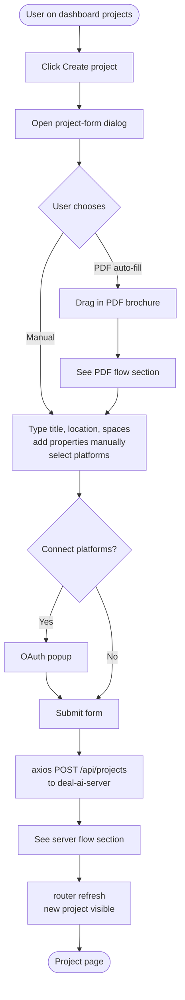
```mermaid
flowchart TD
    Start([User on dashboard projects]) --> Click[Click Create project]
    Click --> Form[Open project-form dialog]
    Form --> Choice{User chooses}
    Choice -->|Manual| Fill[Type title, location, spaces<br/>add properties manually<br/>select platforms]
    Choice -->|PDF auto-fill| PDF[Drag in PDF brochure]
    PDF --> Extract[See PDF flow section]
    Extract --> Fill
    Fill --> Connect{Connect platforms?}
    Connect -->|Yes| Popup[OAuth popup]
    Popup --> Submit
    Connect -->|No| Submit[Submit form]
    Submit --> POST[axios POST /api/projects<br/>to deal-ai-server]
    POST --> Backend[See server flow section]
    Backend --> Refresh[router refresh<br/>new project visible]
    Refresh --> End([Project page])
```

### Server-side project creation

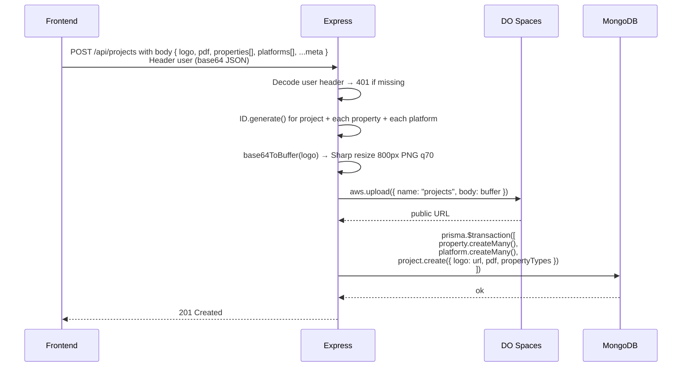
```mermaid
sequenceDiagram
    participant FE as Frontend
    participant BE as Express
    participant S3 as DO Spaces
    participant DB as MongoDB

    FE->>BE: POST /api/projects with body { logo, pdf, properties[], platforms[], ...meta }<br/>Header user (base64 JSON)
    BE->>BE: Decode user header → 401 if missing
    BE->>BE: ID.generate() for project + each property + each platform
    BE->>BE: base64ToBuffer(logo) → Sharp resize 800px PNG q70
    BE->>S3: aws.upload({ name: "projects", body: buffer })
    S3-->>BE: public URL
    BE->>DB: prisma.$transaction([<br/>  property.createMany(),<br/>  platform.createMany(),<br/>  project.create({ logo: url, pdf, propertyTypes })<br/>])
    DB-->>BE: ok
    BE-->>FE: 201 Created
```

Refs: `deal-ai-server/src/routes/projects.js:52-145`, `deal-ai/src/components/project-form.tsx`.

### Edit / soft-delete / restore

- **Edit**: `PATCH /api/projects/:id` with body fields.
- **Soft-delete**: PATCH `deletedAt = now`. Item moves to `/dashboard/bin`.
- **Restore**: PATCH `deletedAt = null`. Listed in `/dashboard/projects` again.

---

## 8. PDF Brochure Auto-fill

This is the killer onboarding feature: drag a PDF, get the form filled in.

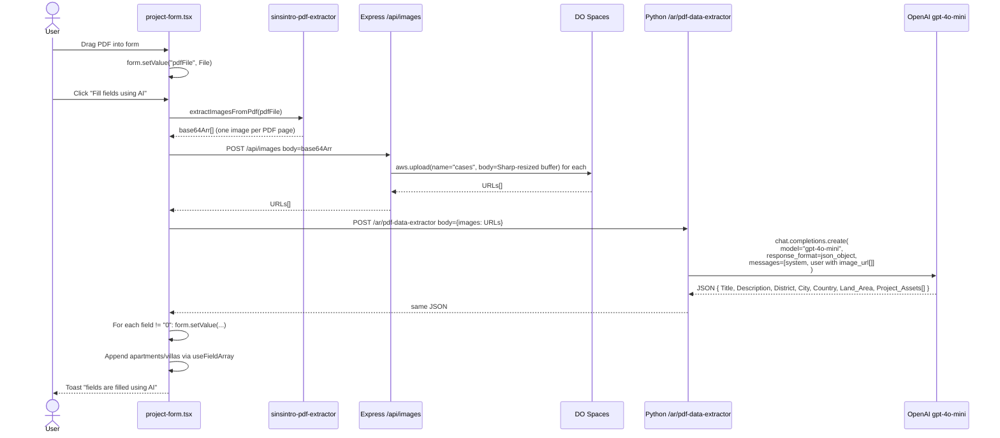
```mermaid
sequenceDiagram
    actor U as User
    participant FE as project-form.tsx
    participant PDF as sinsintro-pdf-extractor
    participant BE as Express /api/images
    participant S3 as DO Spaces
    participant PY as Python /ar/pdf-data-extractor
    participant OAI as OpenAI gpt-4o-mini

    U->>FE: Drag PDF into form
    FE->>FE: form.setValue("pdfFile", File)
    U->>FE: Click "Fill fields using AI"
    FE->>PDF: extractImagesFromPdf(pdfFile)
    PDF-->>FE: base64Arr[]  (one image per PDF page)
    FE->>BE: POST /api/images  body=base64Arr
    BE->>S3: aws.upload(name="cases", body=Sharp-resized buffer) for each
    S3-->>BE: URLs[]
    BE-->>FE: URLs[]
    FE->>PY: POST /ar/pdf-data-extractor  body={images: URLs}
    PY->>OAI: chat.completions.create(<br/>  model="gpt-4o-mini",<br/>  response_format=json_object,<br/>  messages=[system, user with image_url[]]<br/>)
    OAI-->>PY: JSON { Title, Description, District, City, Country, Land_Area, Project_Assets[] }
    PY-->>FE: same JSON
    FE->>FE: For each field != "0": form.setValue(...)
    FE->>FE: Append apartments/villas via useFieldArray
    FE-->>U: Toast "fields are filled using AI"
```

Refs: `deal-ai/src/components/project-form.tsx:140-278`; `TakamolAdvancedAI/app.py:113-171`.

System prompt is reproduced in [Appendix A](#23-appendix-a--key-prompts).

---

## 9. Case Study Generation

The most prompt-heavy flow. One client request fans out to four parallel AI calls.

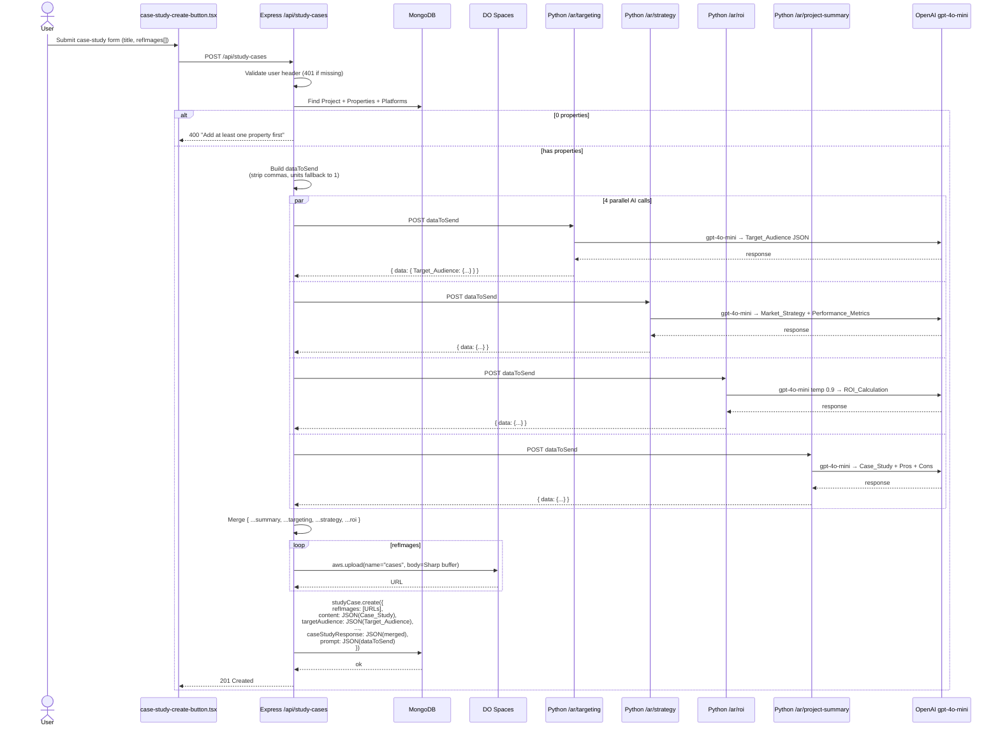
```mermaid
sequenceDiagram
    actor U as User
    participant FE as case-study-create-button.tsx
    participant BE as Express /api/study-cases
    participant DB as MongoDB
    participant S3 as DO Spaces
    participant PY1 as Python /ar/targeting
    participant PY2 as Python /ar/strategy
    participant PY3 as Python /ar/roi
    participant PY4 as Python /ar/project-summary
    participant OAI as OpenAI gpt-4o-mini

    U->>FE: Submit case-study form (title, refImages[])
    FE->>BE: POST /api/study-cases
    BE->>BE: Validate user header (401 if missing)
    BE->>DB: Find Project + Properties + Platforms
    alt 0 properties
        BE-->>FE: 400 "Add at least one property first"
    else has properties
        BE->>BE: Build dataToSend<br/>(strip commas, units fallback to 1)
        par 4 parallel AI calls
            BE->>PY1: POST dataToSend
            PY1->>OAI: gpt-4o-mini → Target_Audience JSON
            OAI-->>PY1: response
            PY1-->>BE: { data: { Target_Audience: {...} } }
        and
            BE->>PY2: POST dataToSend
            PY2->>OAI: gpt-4o-mini → Market_Strategy + Performance_Metrics
            OAI-->>PY2: response
            PY2-->>BE: { data: {...} }
        and
            BE->>PY3: POST dataToSend
            PY3->>OAI: gpt-4o-mini temp 0.9 → ROI_Calculation
            OAI-->>PY3: response
            PY3-->>BE: { data: {...} }
        and
            BE->>PY4: POST dataToSend
            PY4->>OAI: gpt-4o-mini → Case_Study + Pros + Cons
            OAI-->>PY4: response
            PY4-->>BE: { data: {...} }
        end
        BE->>BE: Merge { ...summary, ...targeting, ...strategy, ...roi }
        loop refImages
            BE->>S3: aws.upload(name="cases", body=Sharp buffer)
            S3-->>BE: URL
        end
        BE->>DB: studyCase.create({<br/>  refImages: [URLs],<br/>  content: JSON(Case_Study),<br/>  targetAudience: JSON(Target_Audience),<br/>  ...,<br/>  caseStudyResponse: JSON(merged),<br/>  prompt: JSON(dataToSend)<br/>})
        DB-->>BE: ok
        BE-->>FE: 201 Created
    end
```

### Asset normalization (the comma + units fix)

`study-cases.js` runs every property through:

```js
const stripCommas = v => typeof v === "string" ? v.replace(/,/g, "") : v;
const atLeastOne = v => {
  const cleaned = stripCommas(v);
  const n = parseFloat(cleaned);
  return !isFinite(n) || n < 1 ? "1" : cleaned;
};
```

Reason: `/ar/roi` does `float(price) * int(units)`; commas in `"2,000,000"` blow up `float()`, and `units: "0"` silently produces zero ROI. The frontend sometimes stores numeric fields as comma-formatted strings.

Refs: `deal-ai-server/src/routes/study-cases.js:43-185`; `TakamolAdvancedAI/app.py:1486-1634`.

---

## 10. Post Generation Pipeline

The biggest pipeline in the system. Two-stage: generate ideas, then generate posts (one per idea).

### Stage 1: ideas

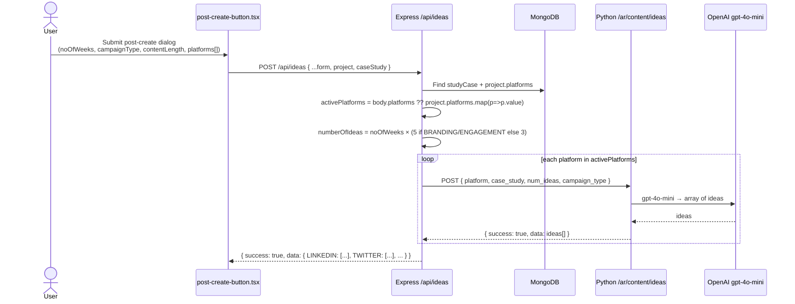
```mermaid
sequenceDiagram
    actor U as User
    participant FE as post-create-button.tsx
    participant BE as Express /api/ideas
    participant DB as MongoDB
    participant PY as Python /ar/content/ideas
    participant OAI as OpenAI gpt-4o-mini

    U->>FE: Submit post-create dialog<br/>(noOfWeeks, campaignType, contentLength, platforms[])
    FE->>BE: POST /api/ideas { ...form, project, caseStudy }
    BE->>DB: Find studyCase + project.platforms
    BE->>BE: activePlatforms = body.platforms ?? project.platforms.map(p=>p.value)
    BE->>BE: numberOfIdeas = noOfWeeks × (5 if BRANDING/ENGAGEMENT else 3)
    loop each platform in activePlatforms
        BE->>PY: POST { platform, case_study, num_ideas, campaign_type }
        PY->>OAI: gpt-4o-mini → array of ideas
        OAI-->>PY: ideas
        PY-->>BE: { success: true, data: ideas[] }
    end
    BE-->>FE: { success: true, data: { LINKEDIN: [...], TWITTER: [...], ... } }
```

### Stage 2: posts (per idea)

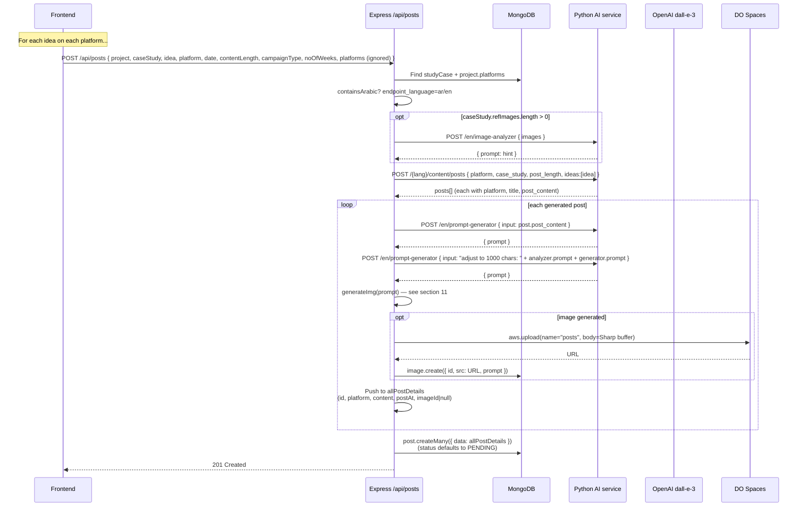
```mermaid
sequenceDiagram
    participant FE as Frontend
    participant BE as Express /api/posts
    participant DB as MongoDB
    participant PY as Python AI service
    participant OAI as OpenAI dall-e-3
    participant S3 as DO Spaces

    Note over FE: For each idea on each platform...
    FE->>BE: POST /api/posts { project, caseStudy, idea, platform, date, contentLength, campaignType, noOfWeeks, platforms (ignored) }
    BE->>DB: Find studyCase + project.platforms
    BE->>BE: containsArabic? endpoint_language=ar/en
    opt caseStudy.refImages.length > 0
        BE->>PY: POST /en/image-analyzer { images }
        PY-->>BE: { prompt: hint }
    end
    BE->>PY: POST /{lang}/content/posts { platform, case_study, post_length, ideas:[idea] }
    PY-->>BE: posts[]  (each with platform, title, post_content)
    loop each generated post
        BE->>PY: POST /en/prompt-generator { input: post.post_content }
        PY-->>BE: { prompt }
        BE->>PY: POST /en/prompt-generator { input: "adjust to 1000 chars: " + analyzer.prompt + generator.prompt }
        PY-->>BE: { prompt }
        BE->>BE: generateImg(prompt) — see section 11
        opt image generated
            BE->>S3: aws.upload(name="posts", body=Sharp buffer)
            S3-->>BE: URL
            BE->>DB: image.create({ id, src: URL, prompt })
        end
        BE->>BE: Push to allPostDetails<br/>(id, platform, content, postAt, imageId|null)
    end
    BE->>DB: post.createMany({ data: allPostDetails })<br/>(status defaults to PENDING)
    BE-->>FE: 201 Created
```

### Day-of-week distribution (frontend logic)

```js
// post-create-button.tsx:104-150
const noOfPostsPerWeek =
  data.campaignType === "BRANDING_AWARENESS" || data.campaignType === "ENGAGEMENT"
    ? 5 : 3;
const daysToPost = noOfPostsPerWeek === 3 ? [0, 2, 4] : [0, 1, 2, 3, 4];
// Each idea gets postAt incremented day by day, skipping non-daysToPost,
// random hour 11-20 local.
```

So a 5-week BRANDING_AWARENESS campaign with 4 platforms = **5 × 5 × 4 = 100 posts**. Each calls `/api/posts` separately.

Refs:
- `deal-ai/src/components/post-create-button.tsx:74-186`
- `deal-ai-server/src/routes/posts.js:71-400`
- `deal-ai-server/src/routes/ideas.js:71-205`

---

## 11. Image Generation

The image-gen path went through three iterations:
1. **Original**: Python `/image-model-2` → Ideogram (out of credit).
2. **Local fallback**: Skip image, post text-only.
3. **Current (this codebase)**: Express calls OpenAI dall-e-3 directly with retry-on-429.

### Current flow

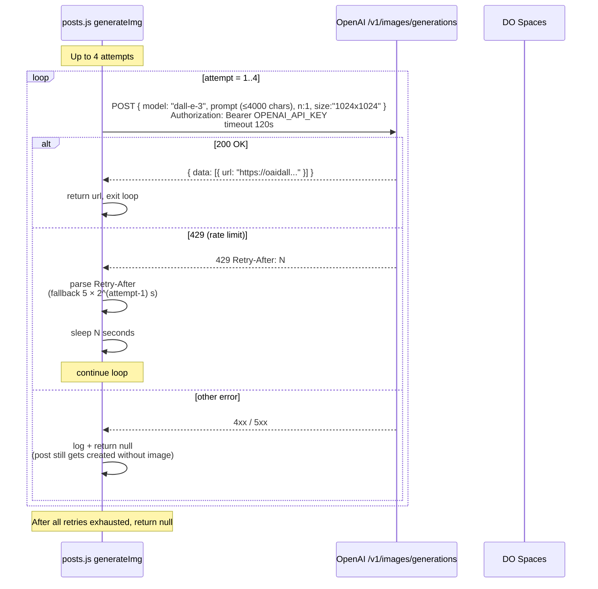
```mermaid
sequenceDiagram
    participant BE as posts.js generateImg
    participant OAI as OpenAI /v1/images/generations
    participant S3 as DO Spaces

    Note over BE: Up to 4 attempts
    loop attempt = 1..4
        BE->>OAI: POST { model: "dall-e-3", prompt (≤4000 chars), n:1, size:"1024x1024" }<br/>Authorization: Bearer OPENAI_API_KEY<br/>timeout 120s
        alt 200 OK
            OAI-->>BE: { data: [{ url: "https://oaidall..." }] }
            BE->>BE: return url, exit loop
        else 429 (rate limit)
            OAI-->>BE: 429 Retry-After: N
            BE->>BE: parse Retry-After<br/>(fallback 5 × 2^(attempt-1) s)
            BE->>BE: sleep N seconds
            Note over BE: continue loop
        else other error
            OAI-->>BE: 4xx / 5xx
            BE->>BE: log + return null<br/>(post still gets created without image)
        end
    end
    Note over BE: After all retries exhausted, return null
```

After `generateImg` returns a URL:

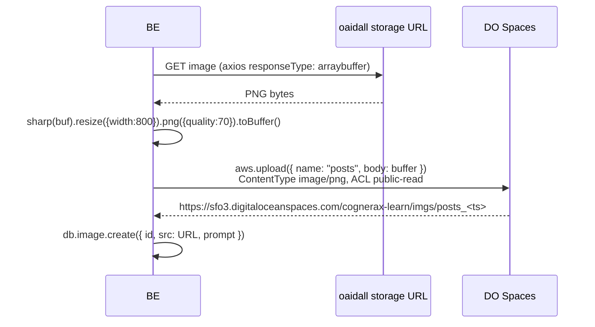
```mermaid
sequenceDiagram
    participant BE
    participant OAI as oaidall storage URL
    participant S3 as DO Spaces

    BE->>OAI: GET image (axios responseType: arraybuffer)
    OAI-->>BE: PNG bytes
    BE->>BE: sharp(buf).resize({width:800}).png({quality:70}).toBuffer()
    BE->>S3: aws.upload({ name: "posts", body: buffer })<br/>ContentType image/png, ACL public-read
    S3-->>BE: https://sfo3.digitaloceanspaces.com/cognerax-learn/imgs/posts_<ts>
    BE->>BE: db.image.create({ id, src: URL, prompt })
```

### Why dall-e-3 directly (not Python)?

The Python service's `/image-model-2` proxies to Ideogram, which ran out of API credits. Going direct from Express to OpenAI:
- Avoids the dead Python path.
- Lets us own the retry-on-429 logic in JS.
- Keeps the Sharp + S3 upload colocated with the Post insert.

Refs: `deal-ai-server/src/routes/posts.js:56-108` (and identical copy in `ideas.js`).

---

## 12. Social-Media OAuth & Posting

### LinkedIn — popup OAuth

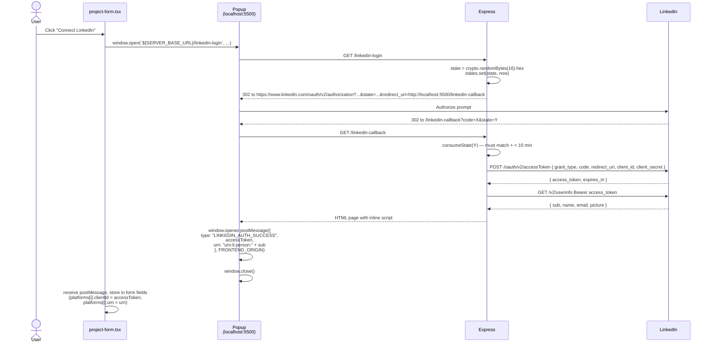
```mermaid
sequenceDiagram
    actor U as User
    participant Form as project-form.tsx
    participant Pop as Popup<br/>(localhost:5500)
    participant BE as Express
    participant LI as LinkedIn

    U->>Form: Click "Connect LinkedIn"
    Form->>Pop: window.open(`${SERVER_BASE_URL}/linkedin-login`, ...)
    Pop->>BE: GET /linkedin-login
    BE->>BE: state = crypto.randomBytes(16).hex<br/>states.set(state, now)
    BE-->>Pop: 302 to https://www.linkedin.com/oauth/v2/authorization?...&state=...&redirect_uri=http://localhost:5500/linkedin-callback
    Pop->>LI: Authorize prompt
    LI-->>Pop: 302 to /linkedin-callback?code=X&state=Y
    Pop->>BE: GET /linkedin-callback
    BE->>BE: consumeState(Y) — must match + < 10 min
    BE->>LI: POST /oauth/v2/accessToken { grant_type, code, redirect_uri, client_id, client_secret }
    LI-->>BE: { access_token, expires_in }
    BE->>LI: GET /v2/userinfo Bearer access_token
    LI-->>BE: { sub, name, email, picture }
    BE-->>Pop: HTML page with inline script
    Pop->>Pop: window.opener.postMessage({<br/>  type: "LINKEDIN_AUTH_SUCCESS",<br/>  accessToken,<br/>  urn: "urn:li:person:" + sub<br/>}, FRONTEND_ORIGIN)
    Pop->>Pop: window.close()
    Form->>Form: receive postMessage, store in form fields<br/>(platforms[i].clientId = accessToken,<br/> platforms[i].urn = urn)
```

### Twitter — OAuth 2.0 + PKCE

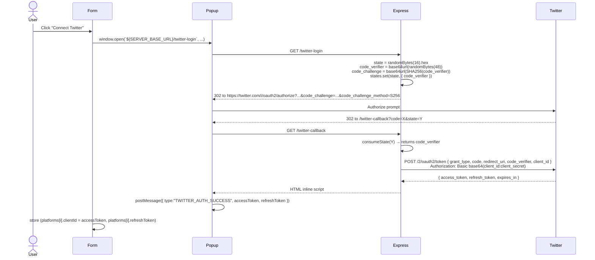
```mermaid
sequenceDiagram
    actor U as User
    participant Form
    participant Pop as Popup
    participant BE as Express
    participant TW as Twitter

    U->>Form: Click "Connect Twitter"
    Form->>Pop: window.open(`${SERVER_BASE_URL}/twitter-login`, ...)
    Pop->>BE: GET /twitter-login
    BE->>BE: state = randomBytes(16).hex<br/>code_verifier = base64url(randomBytes(48))<br/>code_challenge = base64url(SHA256(code_verifier))<br/>states.set(state, { code_verifier })
    BE-->>Pop: 302 to https://twitter.com/i/oauth2/authorize?...&code_challenge=...&code_challenge_method=S256
    Pop->>TW: Authorize prompt
    TW-->>Pop: 302 to /twitter-callback?code=X&state=Y
    Pop->>BE: GET /twitter-callback
    BE->>BE: consumeState(Y) → returns code_verifier
    BE->>TW: POST /2/oauth2/token { grant_type, code, redirect_uri, code_verifier, client_id }<br/>Authorization: Basic base64(client_id:client_secret)
    TW-->>BE: { access_token, refresh_token, expires_in }
    BE-->>Pop: HTML inline script
    Pop->>Pop: postMessage({ type:"TWITTER_AUTH_SUCCESS", accessToken, refreshToken })
    Form->>Form: store (platforms[i].clientId = accessToken, platforms[i].refreshToken)
```

### Posting (LinkedIn)

`publishToLinkedIn({ text, accessToken, urn })` in `deal-ai-server/src/lib/social.js`:

```js
POST https://api.linkedin.com/v2/ugcPosts
Authorization: Bearer ${accessToken}
X-Restli-Protocol-Version: 2.0.0
Content-Type: application/json
{
  "author": "<urn>",
  "lifecycleState": "PUBLISHED",
  "specificContent": {
    "com.linkedin.ugc.ShareContent": {
      "shareCommentary": { "text": "<post text>" },
      "shareMediaCategory": "NONE"
    }
  },
  "visibility": {
    "com.linkedin.ugc.MemberNetworkVisibility": "PUBLIC"
  }
}
```

### Posting (Twitter)

`publishToTwitter({ text, accessToken })`:

```js
POST https://api.twitter.com/2/tweets
Authorization: Bearer ${accessToken}
{ "text": "<post text>" }
```

### Token refresh (Twitter only)

When the cron publisher gets a 401 from `/2/tweets`, it auto-refreshes:

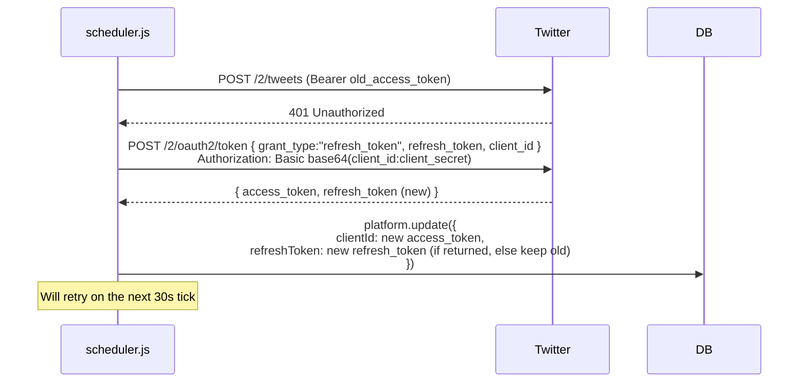
```mermaid
sequenceDiagram
    participant Cron as scheduler.js
    participant TW as Twitter
    participant DB

    Cron->>TW: POST /2/tweets (Bearer old_access_token)
    TW-->>Cron: 401 Unauthorized
    Cron->>TW: POST /2/oauth2/token { grant_type:"refresh_token", refresh_token, client_id }<br/>Authorization: Basic base64(client_id:client_secret)
    TW-->>Cron: { access_token, refresh_token (new) }
    Cron->>DB: platform.update({<br/>  clientId: new access_token,<br/>  refreshToken: new refresh_token (if returned, else keep old)<br/>})
    Note over Cron: Will retry on the next 30s tick
```

Refs: `scheduler.js:150-205`.

---

## 13. Cron Scheduler

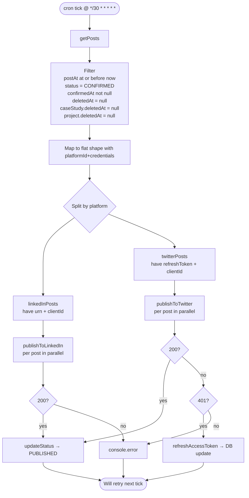
```mermaid
flowchart TD
    Tick([cron tick @ */30 * * * * *]) --> Q[getPosts]
    Q --> Filter[Filter<br/>postAt at or before now<br/>status = CONFIRMED<br/>confirmedAt not null<br/>deletedAt = null<br/>caseStudy.deletedAt = null<br/>project.deletedAt = null]
    Filter --> Map[Map to flat shape with platformId+credentials]
    Map --> Split{Split by platform}
    Split --> LIset[linkedInPosts<br/>have urn + clientId]
    Split --> TWset[twitterPosts<br/>have refreshToken + clientId]
    LIset --> LIpub[publishToLinkedIn<br/>per post in parallel]
    TWset --> TWpub[publishToTwitter<br/>per post in parallel]
    LIpub --> LIok{200?}
    TWpub --> TWok{200?}
    LIok -->|yes| Update[updateStatus → PUBLISHED]
    LIok -->|no| Log[console.error]
    TWok -->|yes| Update
    TWok -->|no| Is401{401?}
    Is401 -->|yes| Refresh[refreshAccessToken → DB update]
    Is401 -->|no| Log
    Refresh --> Done([Will retry next tick])
    Update --> Done
    Log --> Done
```

Refs: `deal-ai-server/src/lib/scheduler.js:1-210`; `deal-ai-server/src/index.js:45`.

---

## 14. Voice Assistant ("Siri")

```mermaid
sequenceDiagram
    actor U as User
    participant UI as siri.tsx
    participant Speech as Web Speech API
    participant Lib as siri.ts (tools)
    participant SDK as openai SDK
    participant API as OpenAI /chat/completions
    participant BE as Express

    U->>UI: Press mic button
    UI->>Speech: useSpeechRecognition.startListening()
    U-->>Speech: speaks "create a project called X..."
    Speech-->>UI: transcript chunks
    UI->>UI: After 3s silence, autosubmit
    UI->>Lib: AI.callChatGPTWithFunctions({ userMessage, existingMessages })
    Lib->>SDK: openai.chat.completions.create({<br/>  model: "gpt-4o",<br/>  messages: [system, ...history, user],<br/>  functions: tools,<br/>  function_call: "auto"<br/>})
    SDK->>API: HTTPS
    API-->>SDK: { choices: [{ finish_reason: "function_call", message: { function_call: { name: "createProject", arguments: "{...}" } } }] }
    SDK-->>Lib: response
    Lib->>Lib: Find tool by name → tool.trigger({ args, response: parsedArgs })
    Lib->>BE: axios.post("/api/projects", body)  (the trigger fn)
    BE-->>Lib: 201 ok
    Lib-->>UI: appended assistant message "Project created"
    UI->>Speech: useTextToSpeech.speak(content)
    Speech-->>U: spoken response
```

### Tools defined in `src/lib/siri.ts`

| Tool | Effect |
|---|---|
| `createProject` | POST `/api/projects` with structured fields |
| `deleteProject` | List user projects, find by title, DELETE |
| `addPropertyTypes` | POST `/api/properties` (bulk) |
| `deleteProperty` | Find + DELETE property |
| `createStudyCase` | POST `/api/study-cases` |
| `deleteStudyCase` | DELETE study case |
| `createPost` | POST `/api/posts` |
| `deletePost` | DELETE post |

Each tool exposes a JSON-schema for its arguments and a `trigger(data)` async fn that performs the side effect.

Wake-word: `"hello"` (line 110-121 in siri.tsx) — listened for in continuous mode; once heard, subsequent transcripts populate the message.

Refs: `deal-ai/src/lib/siri.ts`, `deal-ai/src/components/siri.tsx`, `deal-ai/src/lib/openai.ts`.

---

## 15. Image Editor (Konva)

Entry: `/[lang]/editors/images/:img-id` opens `ImageEditor` which instantiates a `PhotoEditor` Konva wrapper.

```mermaid
flowchart LR
    Stage[Konva Stage] --> Layer[Konva Layer]
    Layer --> Img[Konva Image<br/>fetched from src]
    Layer --> Frame[Konva Image<br/>frame template]
    Layer --> Title[Konva Text<br/>RTL Arabic rotated 90 deg]
    Layer --> CTA[Konva Text<br/>booking button]
    Layer --> Phone[Konva Text<br/>LTR phone]
    Layer --> Site[Konva Text<br/>website URL]
    Layer --> Crop[Konva Rect<br/>dashed crop area]
    Stage --> Transformer[Konva Transformer]
    Transformer -.attaches.-> Img
```

`PhotoEditor` public methods (`src/lib/konva.ts`):

| Method | Purpose |
|---|---|
| `addPhoto(src)` | Load image from URL; scale-fit into crop area |
| `addBase64(b64)` | Same with base64 string |
| `addFrame(frameId)` | Load from `public/frames/frame-XX.png` (regular and filled variants) |
| `addText(opts)` | Add RTL/LTR text node with `lang` parameter |
| `adjustCropRect(ratio)` | Resize crop rectangle |
| `setEditorSize(w, h)` | Update stage dimensions |
| `exportCanvas()` | `stage.toDataURL()` for upload |

Frame templates: `public/frames/frame-01.png` … `frame-05.png` (and `filled/` variants). Each has its own `applyFrame*` constant in `src/lib/constants.ts` that places the title, CTA, phone, and URL at frame-specific coordinates.

---

## 16. Localization

```mermaid
flowchart TD
    Req([Request /products]) --> MW[middleware.ts]
    MW --> Check{Has /en or /ar prefix?}
    Check -->|Yes| Pass[Continue to route]
    Check -->|No| Redirect[302 to /ar/products<br/>defaultLocale=ar]
    Pass --> Layer[layout.tsx]
    Layer -->|getDictionary lang| Dict[dictionaries/ar.ts<br/>or en.ts]
    Layer -->|html dir attribute| Set[dir=rtl if ar, ltr if en]
    Dict --> Comp[Components receive dic prop]
    Comp --> Render([Render with localized strings])
```

### Files
- `src/middleware.ts` — locale routing
- `src/lib/locale.ts` — `i18n` config, `getDictionary()`, `t(value, { from, to })`
- `src/dictionaries/en.ts`, `src/dictionaries/ar.ts` — full UI strings (≈47 KB + 39 KB)
- `src/app/[lang]/layout.tsx:62` — `<html dir={lang === "ar" ? "rtl" : "ltr"}>`

### Dynamic translation
Anything outside the static dictionaries is run through the `translate` npm package (Google Translate under the hood) at request time via `t(text, { from: "en", to: locale })`. Used for backend error messages forwarded to user.

### Backend i18n
Express has its own `src/lib/locale.js` mirror that reads the `locale` request header and provides `c?.["error key"]` lookups for translated error messages. Same dictionary files duplicated server-side.

---

## 17. Storage

### DigitalOcean Spaces

```mermaid
flowchart LR
    BE[Express aws.js] -.aws-sdk.-> S3
    FE[Frontend uploader.ts] -.aws-sdk.-> S3
    S3[(cognerax-learn<br/>sfo3 region)]
    S3 --> CDN[https://sfo3.<br/>digitaloceanspaces.com<br/>+ optional CDN URL]
    CDN --> Browser
```

### Upload prefixes

| `name` arg | Final key | Used by |
|---|---|---|
| `"projects"` | `imgs/projects_<timestamp>` | Project logos |
| `"cases"` | `imgs/cases_<timestamp>` | Study-case ref images, PDF page images |
| `"posts"` | `imgs/posts_<timestamp>` | Post images (DALL-E generated) |

ACL is always `public-read`; Content-Type defaults to `image/png`. The S3 client uses `s3ForcePathStyle: true` (DO Spaces requirement).

### Allowed Next.js remote image hosts

`next.config.mjs:12-52`:
- `cognerax-learn.sfo3.digitaloceanspaces.com`
- `sfo3.digitaloceanspaces.com`
- `cognerax-learn.sfo3.cdn.digitaloceanspaces.com`
- `takamolspace.lon1.digitaloceanspaces.com` (legacy)
- `lon1.digitaloceanspaces.com` (legacy)
- `oaidalleapiprodscus.blob.core.windows.net` (DALL-E temp URLs)
- `ideogram.ai` (legacy)
- `images.unsplash.com`, `plus.unsplash.com`, `source.boringavatars.com`

---

## 18. Frontend API Reference

### Pages (App Router)

| Path | Purpose | Auth |
|---|---|---|
| `/` | Landing → redirect to login if unauth |
| `/[lang]/login` | Email/password + Google OAuth | Public |
| `/[lang]/register` | Email/password sign-up | Public |
| `/[lang]/dashboard` | Overview | Required |
| `/[lang]/dashboard/projects` | Project list | Required |
| `/[lang]/dashboard/projects/[project-id]` | Project detail | Required |
| `/[lang]/dashboard/projects/[project-id]/properties/[property-id]` | Property edit | Required |
| `/[lang]/dashboard/projects/[project-id]/cases/[case-study-id]` | Case study + posts | Required |
| `/[lang]/dashboard/projects/[project-id]/cases/[case-study-id]/posts/[post-id]` | Post edit | Required |
| `/[lang]/dashboard/calender` | Calendar / scheduler view | Required |
| `/[lang]/dashboard/bin` | Trash overview | Required |
| `/[lang]/dashboard/bin/{posts,cases,properties}` | Per-type trash | Required |
| `/[lang]/dashboard/settings` | Settings hub | Required |
| `/[lang]/dashboard/settings/appearance` | Theme | Required |
| `/[lang]/editors/images/[img-id]` | Konva editor | Required |
| `/api/auth/callback/google` | Google OAuth callback | n/a |

### Server Actions (`src/actions/users.ts`)

| Action | Purpose |
|---|---|
| `signUpWithPassword({ name, email, password })` | Create user, hash, session |
| `signInWithPassword({ email, password })` | Verify, session |
| `signInWithGoogle()` | Generate state/codeVerifier, set cookies, redirect to Google |
| `logout()` | Invalidate session, clear cookie, redirect |
| `updateUser({ id, name, email })` | Edit profile |
| `updatePassword({ id, password })` | Re-hash, new session |

### Frontend env vars (consumed in `src/`)

| Variable | Used by | Purpose |
|---|---|---|
| `NEXT_PUBLIC_BASE_URL` | `lib/auth.ts:40` | Google OAuth redirect URI base |
| `NEXT_PUBLIC_SERVER_BASE_URL` | `lib/axios.ts:7`, `scheduler.tsx`, `project-form.tsx` | Express backend base URL |
| `NEXT_PUBLIC_AI_API` | `project-form.tsx:207` | Python AI service base (PDF extractor only on FE) |
| `NEXT_PUBLIC_OPENAI_API_KEY` | `lib/openai.ts:14` | Voice assistant LLM |
| `NEXT_PUBLIC_GOOGLE_MAPS_API_KEY` | (maps component) | Map widgets |
| `GOOGLE_CLIENT_ID` / `GOOGLE_CLIENT_SECRET` | `lib/auth.ts:38-39` | OAuth |
| `DATABASE_URL` | Prisma | MongoDB |
| `DO_SPACE_*` (URL/REGION/ID/SECRET/BUCKET) | `lib/uploader.ts` | DO Spaces |
| `NODE_ENV` | various | Cookie security toggle, error stack |

---

## 19. Backend API Reference

### Server config (`src/index.js`)

| Setting | Value |
|---|---|
| Port | `process.env.PORT ?? 8080` (production .env sets 5500) |
| Body limit | 100 MB JSON / 100 MB urlencoded |
| CORS origins | `http://localhost:3000`, `https://urchin-app-6wl4t.ondigitalocean.app` |
| CORS headers | `Content-Type`, `locale`, `user` |
| HTTP timeout | 300 000 ms (5 min) |
| Cron interval | `*/30 * * * * *` (every 30 s) |

### Endpoints

| Method | Path | Purpose | Auth | Externals called |
|---|---|---|---|---|
| GET | `/` | Health | — | — |
| GET | `/api/projects` | List projects | — | — |
| POST | `/api/projects` | Create project + properties + platforms | user header | DO Spaces |
| PATCH | `/api/projects/:id` | Update project | user header | — |
| DELETE | `/api/projects/:id` | Hard-delete project | user header | — |
| GET | `/api/properties` | List properties | — | — |
| POST | `/api/properties` | Bulk-create properties | user header | — |
| PATCH | `/api/properties/:id` | Update property | user header | — |
| DELETE | `/api/properties/:id` | Hard-delete property | user header | — |
| GET | `/api/study-cases` | List case studies | — | — |
| POST | `/api/study-cases` | Create case study (4 parallel AI calls) | user header | Python ×4, DO Spaces |
| PATCH | `/api/study-cases/:id` | Update case study | user header | — |
| DELETE | `/api/study-cases/:id` | Hard-delete case study | user header | — |
| GET | `/api/ideas` | List "ideas" (likely unused) | — | — |
| POST | `/api/ideas` | Generate per-platform content ideas | user header | Python (per platform) |
| GET | `/api/posts` | List posts | — | — |
| GET | `/api/posts/caseStudyId` | List posts for caseStudy | — | — |
| POST | `/api/posts` | Multi-step post-gen pipeline | user header | Python ×3-4, OpenAI dall-e-3, DO Spaces |
| PATCH | `/api/posts/:id` | Update post (status, content, etc.) | user header | — |
| DELETE | `/api/posts/:id` | Hard-delete post | user header | — |
| GET | `/api/images` | List images | — | — |
| POST | `/api/images` | Bulk upload base64 images to S3 | — | DO Spaces |
| POST | `/api/images/regenerate` | Regenerate single image from prompt | user header | Python |
| POST | `/api/images/prompts/regenerate` | Refine prompt text | user header | Python |
| PATCH | `/api/images/:id` | Update image src/metadata | user header | DO Spaces (if base64) |
| GET | `/linkedin-login` | OAuth init (popup) | — | LinkedIn |
| GET | `/linkedin-callback` | OAuth code exchange | — | LinkedIn ×2 |
| POST | `/linkedin-post` | Publish to LinkedIn | — | LinkedIn |
| GET | `/twitter-login` | OAuth init with PKCE | — | Twitter |
| GET | `/twitter-callback` | OAuth code exchange | — | Twitter |
| POST | `/post-tweet` | Publish to Twitter | — | Twitter |

### Backend env vars

| Variable | Required | Purpose |
|---|---|---|
| `PORT` | no | Server port (default 8080; set to 5500) |
| `NODE_ENV` | no | Stack-trace toggling |
| `DATABASE_URL` | yes | MongoDB connection string |
| `NEXT_PUBLIC_AI_API` | yes | Python AI service base URL |
| `FRONTEND_ORIGIN` | no | postMessage targetOrigin (default `http://localhost:3000`) |
| `LINKEDIN_CLIENT_ID` / `LINKEDIN_CLIENT_SECRET` / `LINKEDIN_REDIRECT_URI` | yes | LinkedIn OAuth |
| `TWITTER_CLIENT_ID` / `TWITTER_CLIENT_SECRET` / `TWITTER_REDIRECT_URI` | yes | Twitter OAuth |
| `OPENAI_API_KEY` (or `NEXT_PUBLIC_OPENAI_API_KEY` fallback) | yes | dall-e-3 image gen |
| `DO_SPACE_*` | yes | DO Spaces credentials |

---

## 20. Python AI Service Reference

Bootstrap: `app.py:53-78`. Local-dev: `python app.py` → `127.0.0.1:5000`. Prod: `gunicorn -w 4 -b :$PORT app:app`.

### Endpoint catalog

| Method / Path | Purpose | Helper / model |
|---|---|---|
| `POST /ar/pdf-data-extractor` | Vision-extract project metadata from PDF page images | `pdf_extractor` / **gpt-4o-mini** vision |
| `POST /shortcontent` | Short / Medium / Long copy variants | `short_content_generator` / gpt-4o-mini |
| `POST /en/chat/casestudy` | Case study EN | `case_study_ai` / gpt-4o-mini |
| `POST /ar/chat/casestudy` | Case study AR | same |
| `POST /en/chat/socialmediaplan` | Social plan EN | `social_media_ai` / gpt-4o-mini |
| `POST /ar/chat/socialmediaplan` | Social plan AR | same |
| `POST /image` | Direct image gen | `image_creator` / **dall-e-2** 1024² hd vivid |
| `POST /image2` | Investment image | same |
| `POST /image-model-2` | Architectural render via **Ideogram V_2** RENDER_3D 16:9 | `generate_image_from_ideogram` |
| `POST /image-model-2-remix` | Ideogram remix from URL | `generate_image_from_ideogram_remix` |
| `POST /en/prompt-generator` | Build creative image prompt EN | `prompt_creator` / gpt-4o-mini |
| `POST /ar/prompt-generator` | Same AR | same |
| `POST /en/prompt-enhancer` | Refine user prompt EN | `prompt_enhancer` / gpt-4o-mini |
| `POST /ar/prompt-enhancer` | Same AR | same |
| `POST /en/image-analyzer` | Compare images, extract differences | `image_analyzer` / gpt-4o-mini vision |
| `POST /ar/image-analyzer` | Same AR | same |
| `POST /investment/image-analyzer` | Investment image analysis | same |
| `POST /en/investment` | Investment analysis EN | `investment_generator` / gpt-4o-mini temp 0.9 |
| `POST /ar/investment-selector` | Detect property type from input | `investment_selector` / gpt-4o-mini |
| `POST /ar/investment-editor` | Edit investment proposal | `investment_editor` / gpt-4o-mini |
| `POST /simple-investment` | Simplified single-tower analysis | inline / gpt-4o-mini |
| `POST /ar/investment-residential-building` | Per-type investment | dynamic route |
| `POST /ar/investment-residential-commercial-building` | (multiplier 2.0) | dynamic |
| `POST /ar/investment-commercial-building` | | dynamic |
| `POST /ar/investment-shopping-mall` | | dynamic |
| `POST /ar/investment-villas` | | dynamic |
| `POST /ar/investment-villa` | | dynamic |
| `POST /ar/investment-residential-compound` | | dynamic |
| `POST /ar/investment-administrative-building` | | dynamic |
| `POST /ar/investment-hotel` | | dynamic |
| `POST /ar/investment-Commercial_residential_tower` | | dynamic |
| `POST /ar/investment-Commercial_and_administrative_tower` | | dynamic |
| `POST /ar/investment-administrative_tower` | | dynamic |
| `POST /analyze-map` | Analyze Google Maps URL via vision | inline / **gpt-4o** vision |
| `POST /ar/analyze-location` | 1-2 sentence Arabic explanation | `generate_location_why_ar` / gpt-4o-mini |
| `POST /group-services` | Group services by category | `group_services` / gpt-4o-mini temp 0 |
| `POST /unreal-engine-chat-v1` | Conversational chat | `Unreal_Engine_Chat` / gpt-4o-mini |
| `POST /compare-two-projects` | Compare two RE projects financially | `start_comparison` |
| `POST /ar/recommend-property-type` | Bilingual property-type recommendation | `property_type_recommendation` / gpt-4o-mini |
| `POST /ar/land-best-use-conclusion` | Best-use conclusion | `land_best_use_conclusion` / gpt-4o-mini |
| `POST /ar/targeting` | Audience targeting | `create_platform_targeting` / gpt-4o-mini temp 0.3 |
| `POST /ar/strategy` | Marketing strategy | `generate_market_strategy` / gpt-4o-mini |
| `POST /ar/roi` | ROI projections | `calculate_roi_projections` / gpt-4o-mini temp 0.9 |
| `POST /ar/marketing-analysis` | All four (parallel ThreadPoolExecutor) | composite |
| `POST /ar/project-summary` | Case study + pros/cons | `calculate_project_summary` / gpt-4o-mini |
| `POST /ar/content/generate` | Combined ideas + posts | `ContentGenerator` |
| `POST /ar/content/ideas` | Per-platform ideas | `generate_content_ideas` / gpt-4o-mini |
| `POST /ar/content/posts` | Per-platform posts from ideas | `generate_posts_for_ideas` / gpt-4o-mini |
| `GET /twitter-login` | (legacy) Twitter OAuth init | uses `TWITTER_CLIENT_ID` |
| `GET /twitter-callback` | (legacy) Twitter token exchange | session-stored |
| `POST /post-tweet` | (legacy) Tweet | session-token |
| `GET /fetch-and-delete-first-tweet` | (legacy) Cleanup tool | |
| `GET /linkedin-login` | (legacy) LinkedIn OAuth init | |
| `GET /linkedin-callback` | (legacy) Token exchange | |
| `POST /linkedin-post` | (legacy) Post text | |

> **Note**: The Python service's OAuth + posting endpoints are legacy and overlap with the Express backend's implementation. The Express versions (`deal-ai-server/src/routes/{linkedin,twitter}.js`) are now canonical; the Python ones can be considered deprecated.

### Models in use (Python service)

| Model | Where | Role |
|---|---|---|
| `gpt-4o-mini` | most text + vision endpoints | Default workhorse |
| `gpt-4o` | `/analyze-map` only | Higher-quality vision |
| `dall-e-2` | `/image`, `/image2` | Quick generation |
| `dall-e-3` | `investment_image_creator` (semaphore=5) | High-quality investment images |
| Ideogram V_2 | `/image-model-2`, `/image-model-2-remix` | Architectural renders (16:9, RENDER_3D) |

### Concurrency primitives

- `task_queue = Queue()` (`app.py:75`) for async image-gen tasks.
- `semaphore = threading.Semaphore(5)` (`app.py:77`) caps concurrent image generation.
- `concurrent.futures.ThreadPoolExecutor` (`app.py:1580`) parallelizes the four marketing-analysis sub-calls.

### Python env vars

| Variable | Purpose |
|---|---|
| `OPENAI_API_KEY` | OpenAI auth (chat + image) |
| `IDEOGRAM_API_KEY` | Ideogram auth |
| `TWITTER_CLIENT_ID` / `TWITTER_CLIENT_SECRET` | (legacy) Twitter OAuth |
| `LINKEDIN_CLIENT_ID` / `LINKEDIN_CLIENT_SECRET` | (legacy) LinkedIn OAuth |
| `DOMAIN_ORIGIN` | Frontend origin for OAuth redirects |
| `PORT` | Server port (gunicorn) |

---

## 21. Configuration / Environment Variables

### Frontend `.env`

```bash
NEXT_PUBLIC_BASE_URL=http://localhost:3000
NEXT_PUBLIC_SERVER_BASE_URL=http://localhost:5500
NEXT_PUBLIC_AI_API=http://localhost:5000

DATABASE_URL=mongodb+srv://...

GOOGLE_CLIENT_ID=...
GOOGLE_CLIENT_SECRET=...
NEXT_PUBLIC_GOOGLE_MAPS_API_KEY=...

DO_SPACE_URL=https://sfo3.digitaloceanspaces.com
DO_SPACE_REGION=sfo3
DO_SPACE_ID=...
DO_SPACE_SECRET=...
DO_SPACE_BUCKET=cognerax-learn

NEXT_PUBLIC_OPENAI_API_KEY=sk-...
```

### Backend `.env`

```bash
PORT=5500
NEXT_PUBLIC_AI_API=http://localhost:5000
FRONTEND_ORIGIN=http://localhost:3000

DATABASE_URL=mongodb+srv://...

LINKEDIN_CLIENT_ID=...
LINKEDIN_CLIENT_SECRET=...
LINKEDIN_REDIRECT_URI=http://localhost:5500/linkedin-callback

TWITTER_CLIENT_ID=...
TWITTER_CLIENT_SECRET=...
TWITTER_REDIRECT_URI=http://localhost:5500/twitter-callback

DO_SPACE_URL=https://sfo3.digitaloceanspaces.com
DO_SPACE_REGION=sfo3
DO_SPACE_ID=...
DO_SPACE_SECRET=...
DO_SPACE_BUCKET=cognerax-learn

OPENAI_API_KEY=sk-...
NEXT_PUBLIC_OPENAI_API_KEY=sk-...   # fallback name
```

### Python `.env`

```bash
OPENAI_API_KEY=sk-...
IDEOGRAM_API_KEY=...
TWITTER_CLIENT_ID=...
TWITTER_CLIENT_SECRET=...
LINKEDIN_CLIENT_ID=...
LINKEDIN_CLIENT_SECRET=...
DOMAIN_ORIGIN=http://localhost:3000
```

---

## 22. Deployment

### Local dev

```bash
# Terminal 1: MongoDB Atlas — already remote, nothing to do

# Terminal 2: Python AI service
cd "TakamolAdvancedAI"
.venv\Scripts\python.exe app.py
# → http://127.0.0.1:5000

# Terminal 3: Express backend
cd "deal-ai-server"
yarn dev
# → http://localhost:5500

# Terminal 4: Next.js frontend
cd "deal-ai"
yarn dev
# → http://localhost:3000
```

### Production targets (current)

| Service | Platform | Build/run |
|---|---|---|
| Frontend (`deal-ai`) | Vercel | `next build` then static + serverless |
| Backend (`deal-ai-server`) | DigitalOcean App Platform | `node src/index.js` |
| Python AI (`TakamolAdvancedAI`) | Vercel (`vercel.json`) or Railway (`railway.json`) | `gunicorn -w 4 -b :$PORT app:app` |
| MongoDB | MongoDB Atlas | managed |
| Storage | DigitalOcean Spaces | managed |

No Dockerfile in any repo; all platforms use buildpacks / runtime detection.

---

## 23. Appendix A — Key Prompts

### A.1 PDF data extractor (`app.py:131-163`)

> you will be provided some images and you have to understand it and reply with the data you understood from these images.
> Your response must be in Arabic.
> Guidance:
>   - If there are some floor plans then each one is a separate Asset.
>   - You have to focus on the number of rooms, number of bathrooms, number of living rooms, you have to get them as they are the highest priority.
>   - Asset_Type Must be in English only and select it from one of these: [Apartment, Villa]
>
> Your response should only be in JSON format and look like this:
> ```json
> {
>   "Title": "Project title here",
>   "Description": "make a full Description here",
>   "District": "the district of the project if provided, if not then type 0",
>   "City": "the city of the project if provided, if not then type 0",
>   "Country": "the country of the project if provided, if not then type 0",
>   "Land_Area": "Land Area here if provided, if not then type 0",
>   "Project_Assets": [
>     {
>       "Asset_Type": "Apartment | Villa",
>       "Title": "Asset class",
>       "No_Of_Units": "if not provided, write 0",
>       "Space": "numeric only without unit",
>       "Finishing": "or 0",
>       "Floors": "or 1",
>       "Rooms": "...",
>       "Bathrooms": "...",
>       "Livingrooms": "..."
>     }
>   ]
> }
> ```

### A.2 Investment selector (`openai_api_requests.py:153-178`)

```
أنت أداة استكشاف نوع العقار الذي يريده العميل.
العميل سوف يرسل لك برومبت مثل هذه:
كومباوند عمارات سكنية في حي الياسمين في الرياض.
عليك أن تفهم نوع العقار الذي يريده العميل و ردك يجب أن يكون بصيغة JSON كالتالي:
{
    "مبنى_سكني":"False",
    "مبنى_تجاري":"False",
    ...
    "كومباوند_سكني":"True",
    ...
}
إرشادات:
الفلل لا تعني فيلا.
النوع الصحيح للعقار يجب أن يحمل قيمة True و الباقي يجب أن يحمل قيمة False.
يجب أن يكون اختيار واحد فقط هو الذي يحمل قيمة True.
```

### A.3 Land best-use conclusion (`openai_api_requests.py:762-785`)

```
أنت مستشار تطوير عقاري محترف. مهمتك تحليل بيانات الأرض وتقديم توصية نهائية واضحة ومباشرة للمطور العقاري...

صيغة الرد المطلوبة (JSON):
{
  "best_use": {
    "ar": "نص قصير يحدد أفضل استخدام",
    "en": "A brief statement identifying the best use"
  },
  "conclusion": {
    "ar": "ملخص نهائي احترافي يخاطب المطور العقاري...",
    "en": "A professional final summary..."
  }
}
```

### A.4 Property-type recommendation (`openai_api_requests.py:597-657`)

System prompt frames the model as an "expert real estate analyst" and provides the available property types (13: residential, commercial, mixed, towers, villas, compounds, hotels, etc.). Instructs the model to weigh zoning, density, demographics, facilities, roads, market data; output bilingual JSON with `recommendedType`, confidence 0-100, `reasoning`, `alternatives`, `marketInsights`, `zoningAnalysis`.

---

*End of document.*

> **Generated**: April 2026.
> **Source repos** (now under `Bits-Solutions-co`):
> - `Bits-Solutions-co/deal-ai`
> - `Bits-Solutions-co/deal-ai-server`
> - `Bits-Solutions-co/TakamolAdvancedAI`
